# DIY Home Automation

This is experimental DYI Home(Smart) Automation project for monitoring and control of a house.

**PLEASE Keep in mind that this project is still under development and some parts of code require refactoring.**

It includes lot of electronics circuits and different types of Raspberry Pi controllers.

The system implements variety of communication protocols like: `MQTT`, `I2C`, `1-Wire`, `Serial`, `ZigBee`.

## System Diagram
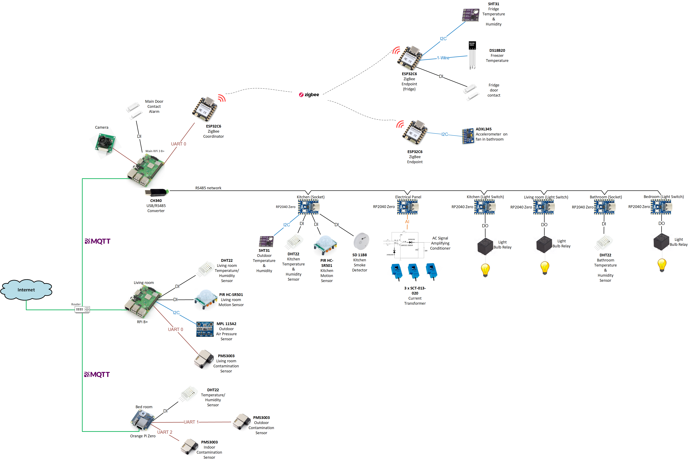

Most of the software is written in Python.

Collected sensor data are stored in MySQL DB and visulized on Grafana and using Flask. Control of devices (light switches, heating, etc) takes place by HTTP request from Grafana and Flask.

The system delivers following features:
- measurement of `outdoor` parameters like temeprature, humidity, pressure, air pollution (PM1, PM2.5, PM10):
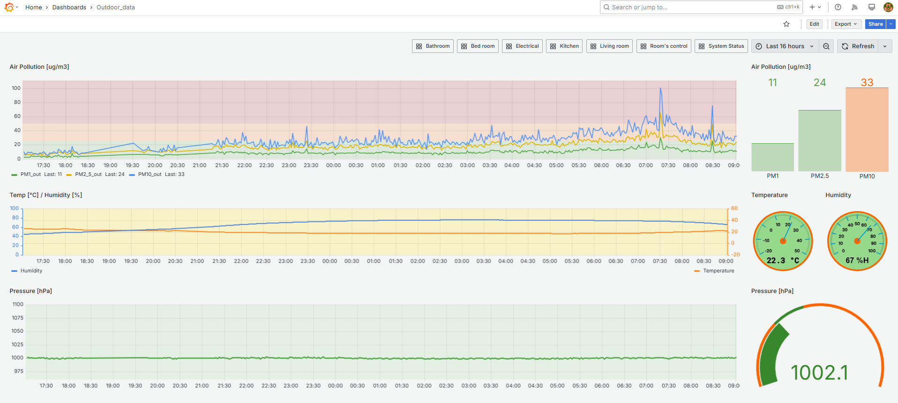

Example of SQL query in Grafana:

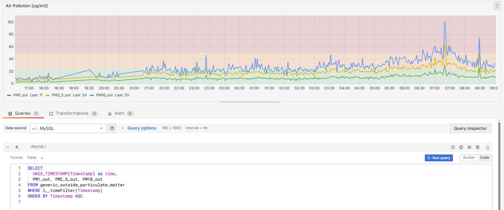

 

- logging of parameter in `living room` like temperature, humidity, air pollution (PM1, PM2.5, PM10) and motion detection:
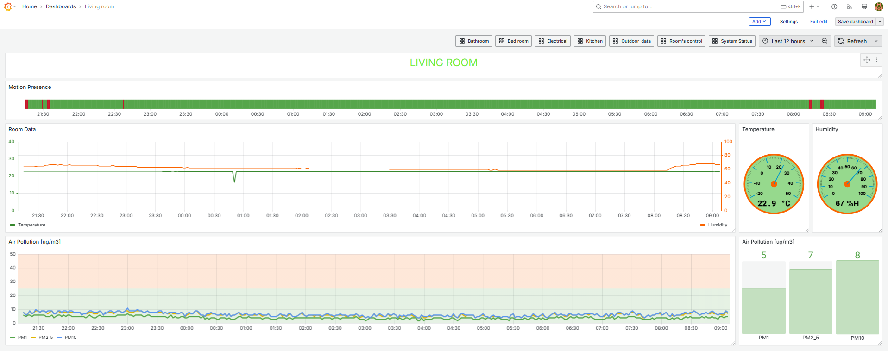

- logging of parameter in `bedroom` like temperature, humidity, air pollution (PM1, PM2.5, PM10):
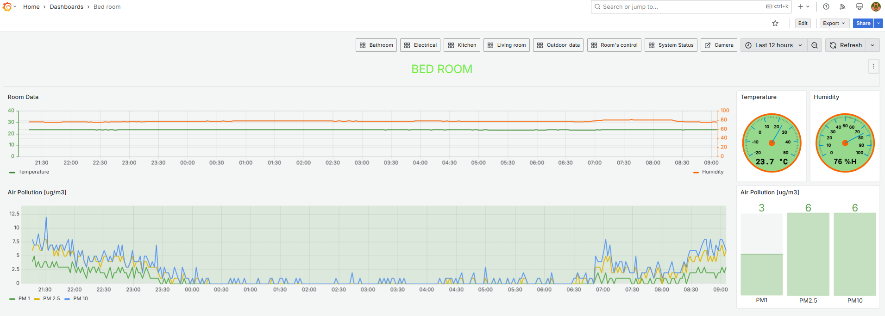

- logging of parameter in `kitchen` like temperature, humidity, motion detection and smoke detection. Additionally the fridge (and freezer) are equipped with sensors for temperature, humidity measurement and door contact to calculate how often the fridge was opened:
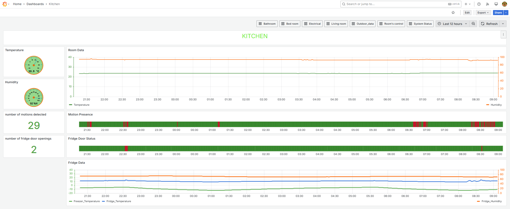

- `electrical energy consumption` measurement of main electrical power supply. It uses CTs assembled in electrical panel and AC signal conditioners which convert it to analog value measured by RP2040:
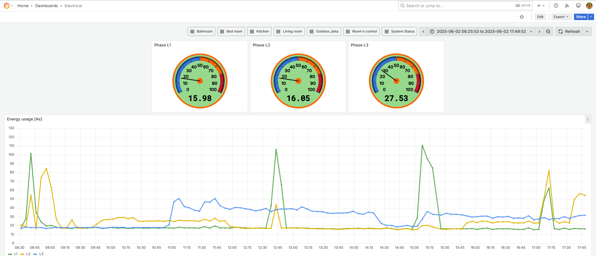
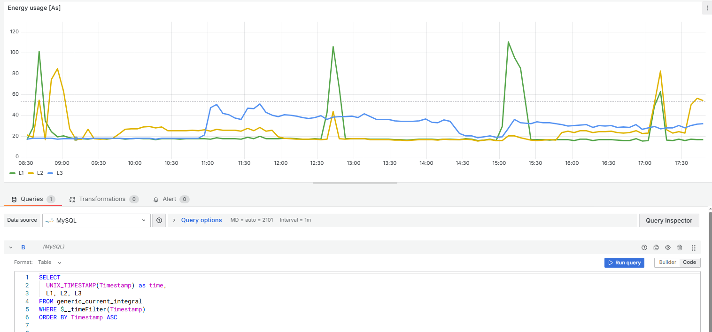

- logging of parameter in `bathroom` like temperature, humidity. Additionally there is vibration sensor installed on the ventilation fan. It calculates definit integral of vibration in each axis within ca. 600ms. 
It detects very well when the fan was turned on and off. It can be used for prediction if fan mechanics deteriorates:
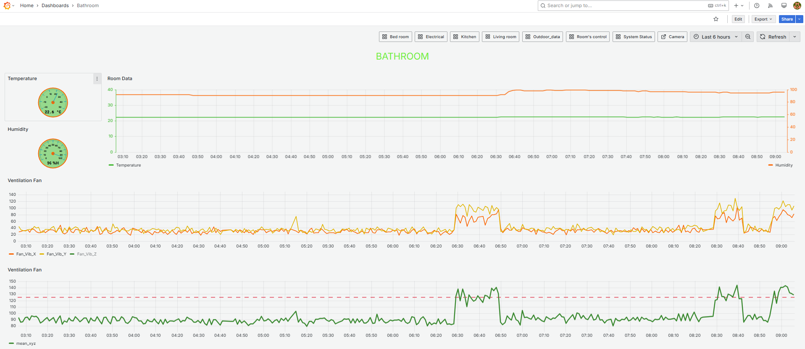
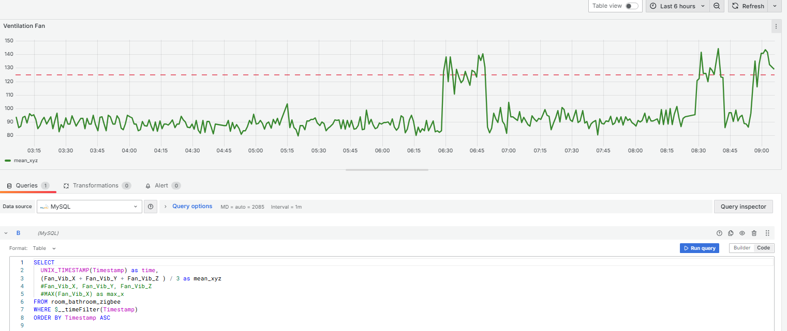

- control of room's `light switches` by sending HTTP request from Grafana or Flask Web Page:
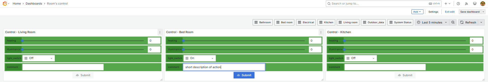
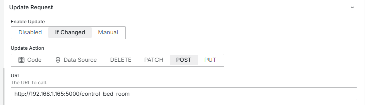

- Monitoring of communication status with all system devices:
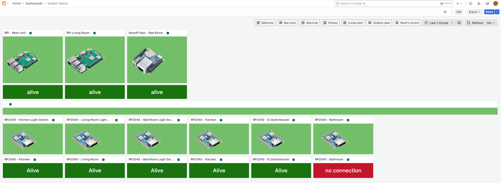

- Video streaming from RPi main camera including motion detection with video/pics storage. 

- Burgler sound alarm using main door contact and motion detection from rooms and camera.